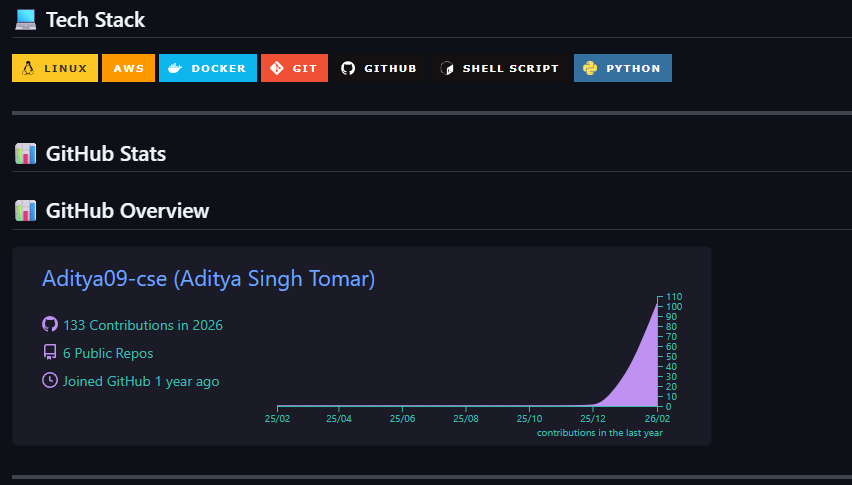
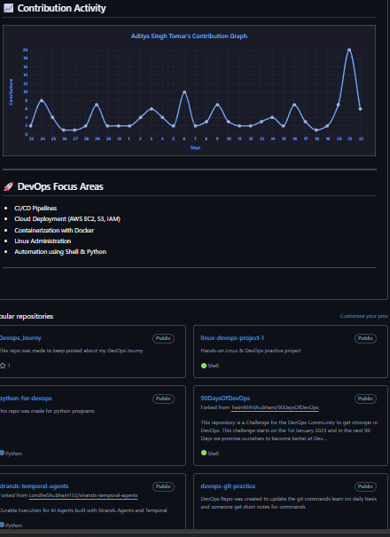

# Day 27 – GitHub Profile Makeover

## 🎯 Objective
Today’s goal was to transform my GitHub profile into a professional developer portfolio that reflects my DevOps journey.

---

## 🔍 Before Audit

Before today, my profile:

- Had a good profile picture
- Had some repositories but not clearly organized
- Some repo descriptions were unclear
- Pinned repos were not fully optimized
- Profile README needed better structure and focus

As a stranger viewing my profile:
- It showed activity
- But it didn’t clearly tell my DevOps story

---

## 🚀 What I Improved

### 1️⃣ Created / Improved Profile README
- Added a clear introduction: Aspiring DevOps Engineer
- Mentioned focus on Cloud & Automation
- Highlighted tech stack (Linux, AWS, Docker, Git, Python, Shell)
- Added contribution stats section
- Structured sections cleanly: About Me, Tech Stack, Focus Areas

Why?
→ A recruiter should understand in 10 seconds what I’m learning and building.

---

### 2️⃣ Organized Repositories
- Cleaned repository names (used lowercase + hyphens)
- Improved repo descriptions
- Ensured every important repo has a proper README
- Structured projects around DevOps learning

Key repos:
- 90DaysOfDevOps
- Devops_Journey
- devops-git-practice
- linux-devops-project-1
- python-for-devops

Why?
→ Repositories now represent focused DevOps learning instead of random uploads.

---

### 3️⃣ Optimized Pinned Repositories
- Selected 6 relevant projects
- Removed irrelevant or less meaningful pins
- Ensured each pinned repo has:
  - Description
  - Proper README
  - Clear purpose

Why?
→ Pinned repos act like a portfolio showcase.

---

### 4️⃣ Profile Presentation
- Clear DevOps identity
- Contribution graph visible and active
- Defined DevOps focus areas:
  - CI/CD Pipelines
  - AWS Cloud (EC2, S3, IAM)
  - Containerization (Docker)
  - Linux Administration
  - Automation using Shell & Python

Why?
→ Profile now reflects direction, not confusion.

---

## 📸 Before & After

### Before

### After

---

## 🧠 3 Key Improvements

1. Clear DevOps positioning instead of generic student profile  
2. Structured repositories with purpose  
3. Professional, recruiter-friendly profile presentation  

---

## 📌 Lesson Learned

Your GitHub is not just code storage.
It’s your developer identity.

Today I stopped treating it like a dump yard.
I started treating it like a portfolio.

#90DaysOfDevOps
